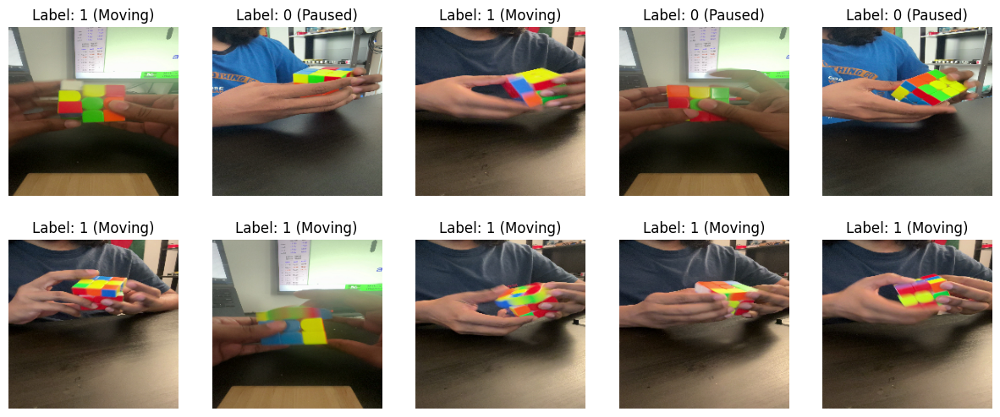
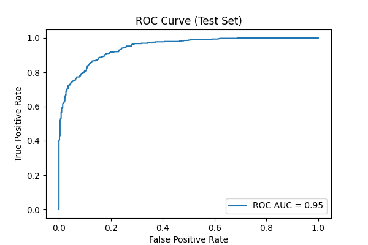
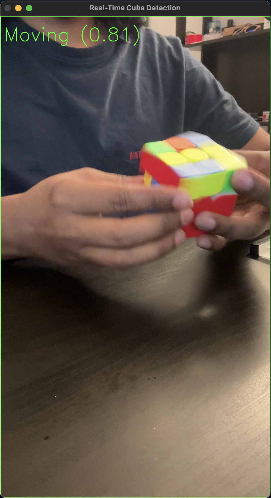
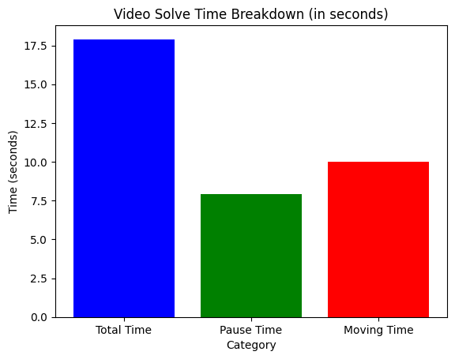

# Rubik’s Cube Pause vs. Moving Detection  

This is my **first machine learning project**, where I built and trained a model to detect whether a Rubik’s Cube is **paused** or **moving** in a video.  

The most important part of this project was creating my own dataset from scratch, which taught me a lot about the challenges of data preparation in ML.  

---

## Project Overview  

- Built a dataset of **9500+ frames** extracted from Rubik’s Cube videos  
  
- Labeled frames into two categories: **Paused** and **Moving**  
- Trained a **MobileNetV2-based CNN** model using TensorFlow/Keras  
- Achieved:  
  - **~86% accuracy**  
  - **0.95 ROC-AUC score**  
  
- Implemented real-time video detection with OpenCV  


---

## Features  

- **Custom dataset creation** (frames extracted + labeled manually)  
- **Model training** with class balancing and augmentation  
- **Real-time detection** with borders + labels:  
  - Red = Paused  
  - Green = Moving  
- **Time analysis graph** showing pause time, move time, and total solve time  

  

---

## Example Output  

- Paused cube frame (red border + label)  
- Moving cube frame (green border + label)  
- Solve time breakdown graph  

   

---

## Installation  

Clone the repository:  
```bash
git clone https://github.com/yourusername/rubiks-cube-detection.git
cd rubiks-cube-detection

